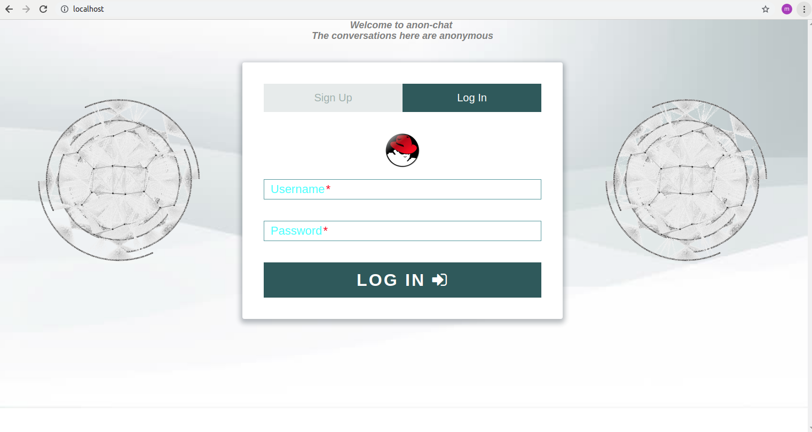
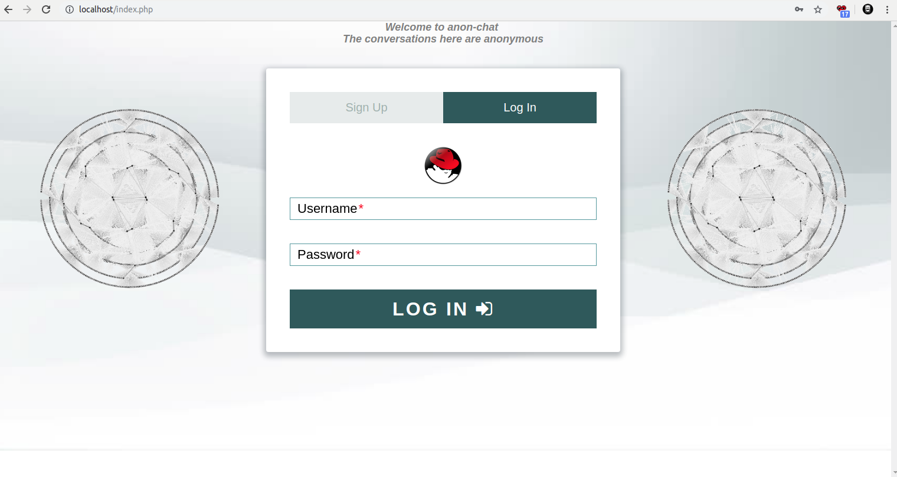
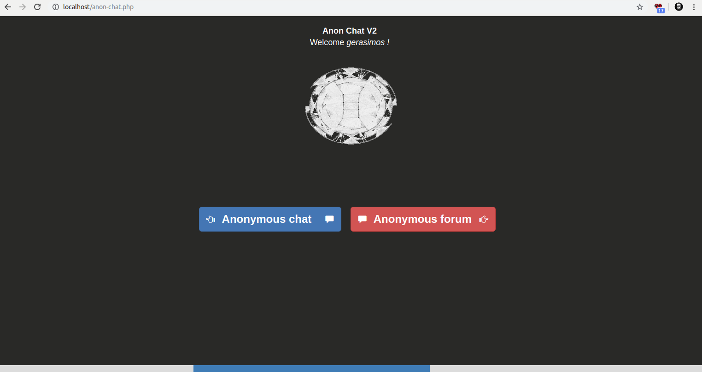
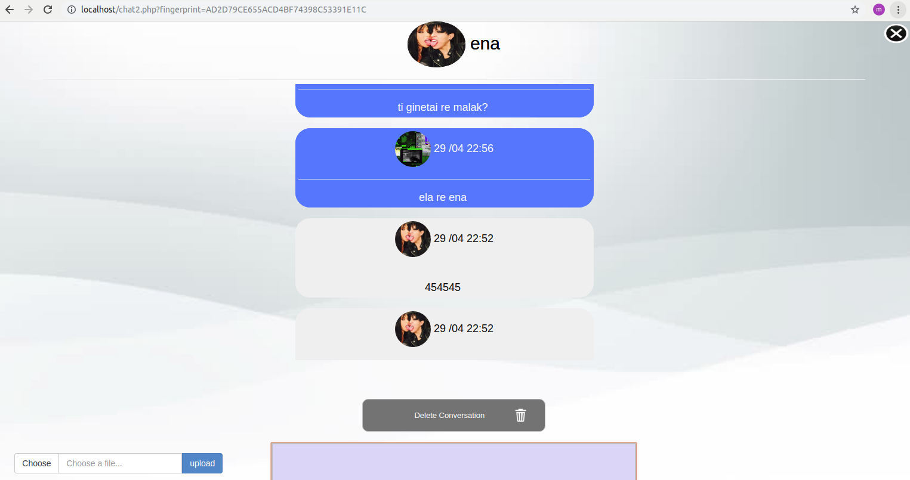
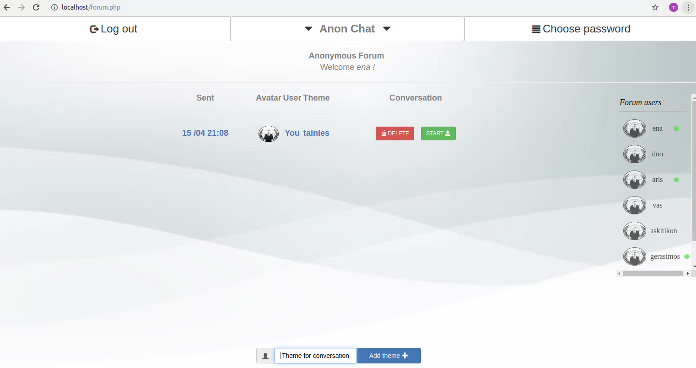
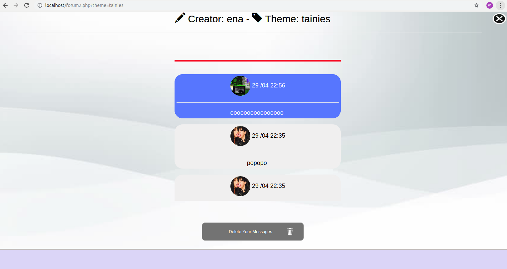

# anon-chat-v2
anon-chat-v2 is a program that allows anonymous conversations.

Use anon-chat-v2 from here: http://chat.openloadlinks.com

Operation of the program.
Complete anonymous use of a two-fold joint connection, creating each time a random key of multidimensional fingerprinting of a 32-character alphanumeric character that changes with each new beginning of the conference.
Complete deletion of the conversations from the database.
Anonymous electronic printouts because only text variables are allowed. (text variables) and not an avatar etc, which leave behind the original electronic fingerprints of the user's source and hard disk.

      

      

      

      

      

 
